# vrlbry

A virtual library for your ZIM files. vrlbry finds the `.zim` files in a folder and shelves their
books in a warm, candle-lit 3D reading room. Walk up to a shelf, pull a book out, look at its
cover, open it and read it page by page. It works in a VR headset (Meta Quest and other WebXR
browsers), on a desktop with mouse and keyboard, and on a phone.

**Try it in your browser: <https://ariamokr.github.io/vrlbry/>.** There is nothing to install. On a
Meta Quest, open the address in its browser and choose *Enter VR*. More books come from
[Kiwix's library](https://library.kiwix.org/), right on the page or on the catalogue stand in VR,
or from ZIM files on your own device.

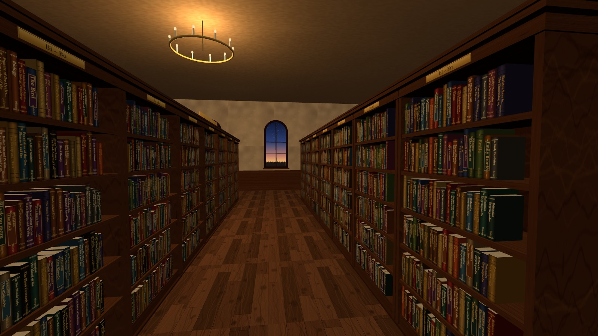

It understands three kinds of [Kiwix ZIM files](https://library.kiwix.org/) especially well:

- **Project Gutenberg** (gutenberg2zim): real covers, authors, popularity ranks and the books' own
  illustrations.
- **Wikisource** (mwoffliner): every multi-part work — novels, collections, histories; 17,693 in
  the English ZIM — becomes one book with all its chapters in order, its cover, author, year and
  genre.
- **Wikipedia** (mwoffliner): a room of encyclopedia volumes, each holding 1,000 articles in
  title order with a matching blue-and-gilt binding, the volume number and title range on the
  spine, and every article starting on a fresh page. The search box finds articles by title and
  opens the right volume at that article. Infoboxes become a "Quick facts" section after the
  introduction, and formulas sit in the text. The first time a Wikipedia ZIM is opened, its
  articles are indexed in the background (about a minute for Simple English).

Other ZIM files also work: their HTML articles become the books, up to 2,000 per file (`--max-generic`).

## Screenshots

| | |
| --- | --- |
| 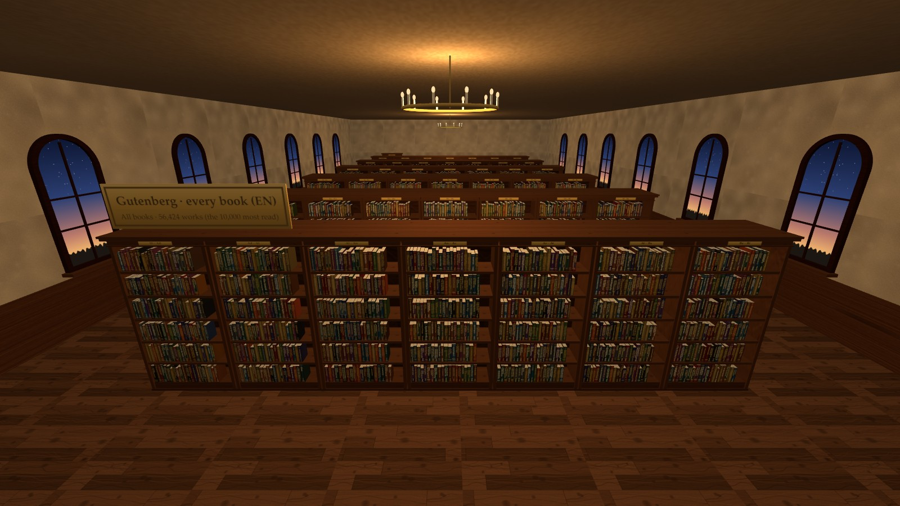 | 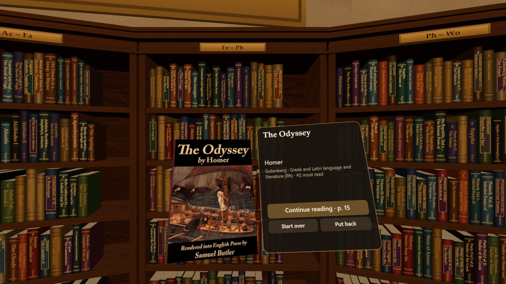 |
| *Gutenberg · every book (EN): its 10,000 most-read books in rows, a room at a time* | *Take a book out: its cover, author and popularity, and Read* |
| 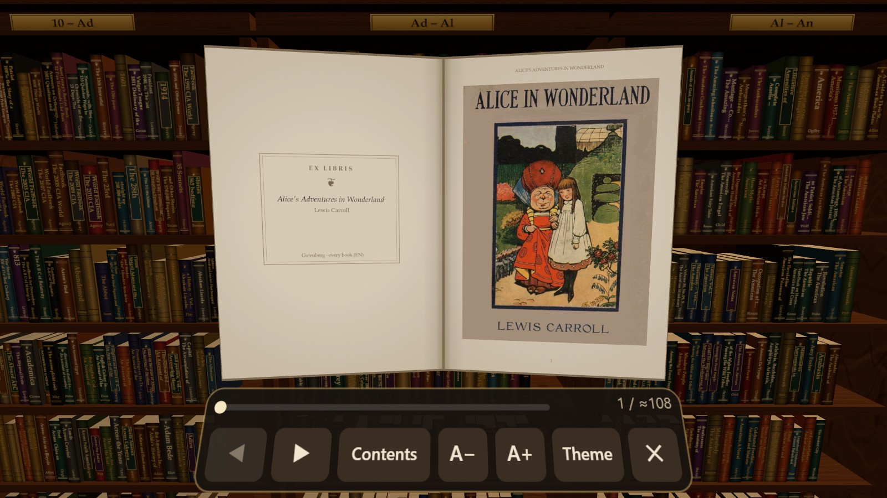 | 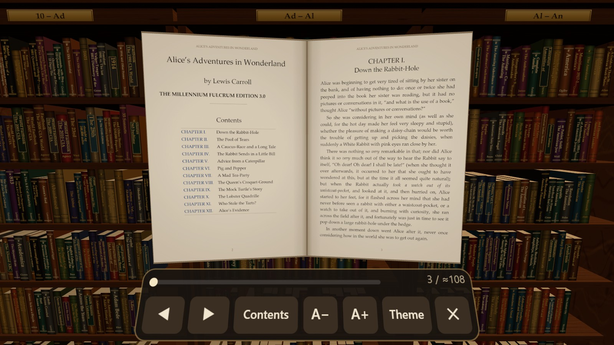 |
| *Open it and turn the pages: the book's own pictures* | *Links work: tap a chapter in the contents, a footnote, a Wikipedia reference* |
| 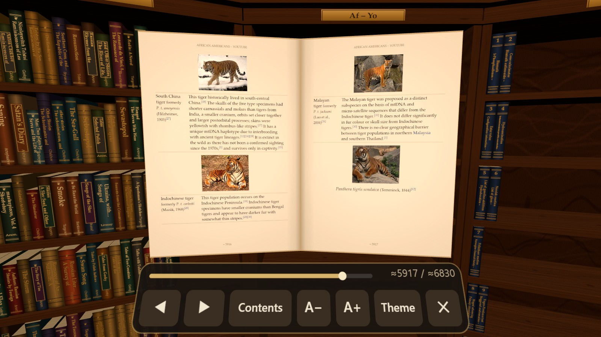 | 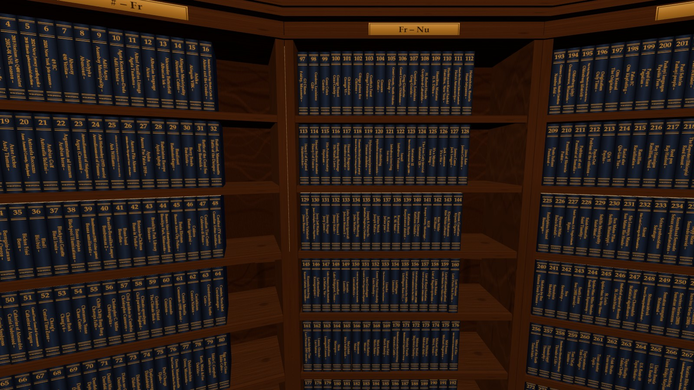 |
| *Wikipedia articles with their pictures, tables and links to other articles* | *A Wikipedia is a set of encyclopedia volumes, 1,000 articles each* |
| 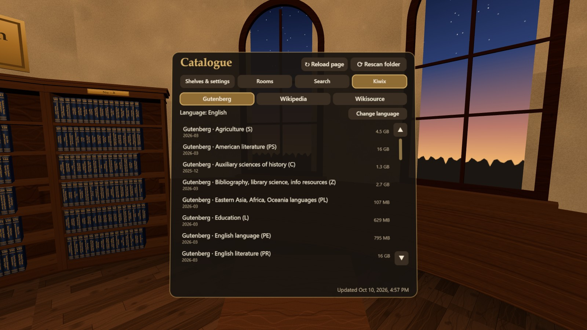 | 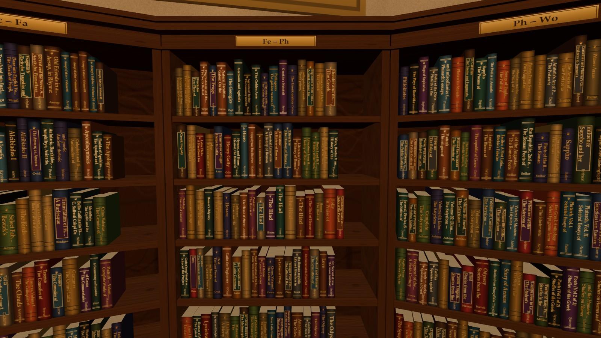 |
| *Kiwix's library on the catalogue stand: open more books from the web, in VR too* | *Every spine shows its title and author* |

## Run it

You need Node.js 22.15 or newer.

```bash
npm install
```

```bash
npm start
```

That serves every `.zim` file in the current folder at <http://localhost:8080>. For a VR headset,
start it with HTTPS as well (HTTP stays on 8080, HTTPS is added on 8443):

```bash
npm run start:https
```

Other options:

```bash
node server/index.js --dir /path/to/zims --port 8080
```

| Option | Meaning |
| --- | --- |
| `--dir <path>` | folder with `.zim` files (default: current folder) |
| `--port <n>` | HTTP port (default 8080; the next free port is used if it is busy) |
| `--host <addr>` | interface to listen on (default: all, so a headset on your network can connect) |
| `--https` | also serve HTTPS, on port 8443, with a self-signed certificate (cached in `.cert/`) |
| `--https-port <n>` | HTTPS port (default 8443) |
| `--no-http` | with `--https`: serve HTTPS only |
| `--cert <file> --key <file>` | use your own certificate |
| `--max-generic <n>` | max books listed from other (non-Gutenberg, non-Wikisource) ZIMs (default 2000) |
| `--no-watch` | don't pick up `.zim` files added or removed while the server runs |
| `--quiet` | print only problems and the address |

## Adding books

Drop more `.zim` files into the folder at any time — no restart needed. The server notices new,
replaced and removed files within a few seconds (a download that is still in progress is
retried once it finishes), and open pages re-shelve by themselves within ~10 seconds. The ⟳
buttons on the library card and on the catalogue stand rescan immediately.

The first time a Wikisource ZIM is opened, the server indexes its works in the background (about
two minutes for the 8.6 GB English one); the library card shows the progress, and the books appear
when it is done. The index is cached in `.cache/`, so later starts are instant. A very large
Gutenberg ZIM (all 56,000 English books) takes about half a minute to open before the server
answers.

Each library is its own **room**: the hall shows one collection at a time, and the **Rooms** tab of
the catalogue stand switches between them. A library as large as Wikisource is narrowed down with
two filters that can be used together or alone: a genre (Novels, Poetry, Drama, History &
biography, Court decisions, …) and the letter titles start with — say, poems starting with A.
Tap a filter again to remove it; with both removed you get the whole library. Up to 10,000 books
are shelved at a time; a bigger room has pages (**Previous** / **Next** on the catalogue stand),
and a Gutenberg collection shelves its most-read books first. As an experiment, **All libraries**
puts all your libraries in one big hall of up to 200 bookcases: small libraries whole, and the
first books of the large ones (each large library gets an equal share). You stay where you are
while the shelves change around you. Search still covers every book of every library: picking
one that is not on the shelves takes you to its room.

## Reading ZIM files in the browser

"Open ZIM files…" under the library list (or dropping `.zim` files on the page) reads ZIMs from
your own device in the browser, in the online version as well as beside a server's libraries:
nothing is uploaded, and only the parts of the file a page needs are read, so even very large
files open quickly. A Wikipedia or Wikisource ZIM is indexed in the browser the first time (a
big one takes minutes on a headset) and the index is kept. The files stay open until the page
is reloaded; where the browser allows it (desktop Chrome and Edge, Quest Browser) the card
offers to reopen them. On a Quest, open them before entering VR.

A ZIM can also be read straight from the web, without downloading it: choose one in Kiwix's
library ("Browse Kiwix's library…" in the card, or the Kiwix tab of the catalogue stand, also in
VR), paste its address into the field under the button (or drop its link on the page), or read
the example from the card.
Kiwix's download links work: they are turned into the same file on Kiwix's own mirror,
`mirror.download.kiwix.org`, the one that lets a web page read its files (its other mirrors do
not). Only what is shown is fetched, a few kilobytes at a time. On a Quest 3 in California,
through the site's proxy, a Gutenberg ZIM opens in about 2 s and the 49 GB
top-million Wikipedia in 2.4 s, finding an article in it in 5 s; from Kiwix's mirror directly
those take 7-9 s, 6-7 s and 10-11 s. Web addresses reopen by themselves when
the page loads; a library's × closes it. A Wikipedia or Wikisource from the web needs a
prebuilt index unless it is small (building one reads most of the file).

The online version reads Kiwix's files through a small edge proxy that picks the mirror nearest
you, when it has one ([how it works and how to run one](docs/DEVELOPMENT.md#reading-zims-from-the-web)).
Only Kiwix's own mirror lets a web page read its files; if you run or know one of the others,
[here is what it would take](docs/MIRRORS.md).

## Using a VR headset

WebXR only runs on a secure page. On the computer itself `http://localhost` counts as secure. A
headset on your Wi-Fi needs one of these:

- **HTTPS:** start with `npm run start:https`, then open `https://<your-computer's-IP>:8443` in the
  headset browser (the server prints the address). The certificate is self-signed, so the browser
  warns once; choose to proceed.
- **USB (Quest):** connect the headset, run `adb reverse tcp:8080 tcp:8080`, and open
  `http://localhost:8080` in the headset browser.

Then press **Enter VR**.

## Controls

| | Desktop | Touch | Gamepad | VR |
| --- | --- | --- | --- | --- |
| Look | drag the mouse | drag one finger | right stick | turn your head |
| Move | W A S D / arrows, Q E to turn, Shift to hurry | drag two fingers | left stick (click it to hurry) | right stick forward: teleport arc · flick right stick: snap turn · left stick: walk |
| Take a book | click it | tap it | aim the crosshair, **A** | point and pull the trigger (or pinch) |
| Read | click the book or **Read** | tap **Read** | **A** | trigger on the book, or **A** |
| Turn pages | ← → Space, or click a page | swipe, or tap a page | bumpers, or D-pad ← → | flick the right stick, or trigger on a page |
| Text size, theme, contents | + / −, toolbar | toolbar | D-pad ↑ ↓ · **Y** · **X** | toolbar |
| Book distance / size | mouse wheel | pinch | triggers | right stick up/down · left stick up/down · grip to move the book |
| Follow a link | click it | tap it | **A** on it | trigger on it |
| Back (along links, then close) | Backspace, or **↩ Back** | **↩ Back** | **B** | **B** or **Y** |
| Close / put back | Esc | **✕** / **Put back** | **B** | **B** or **Y** |
| Book out of sight | **F** | **Bring the book in front of me** (in **?**) | press the right stick | press a thumbstick |
| Back to the start | Home, or **Reset view** (in **?**) | **Reset view** (in **?**) | | |
| Leave VR | | | | hold **B** or **Y** for a second while browsing, or **Exit VR** on the catalogue stand (or the headset's Meta button) |

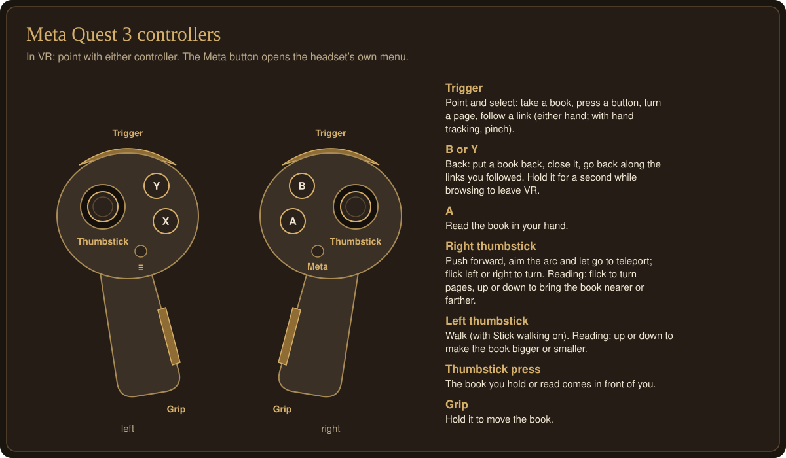

A gamepad (Xbox, PlayStation or another Bluetooth pad) works on a desktop or a phone; it takes
over as soon as you use it, and moving the mouse hands control back.

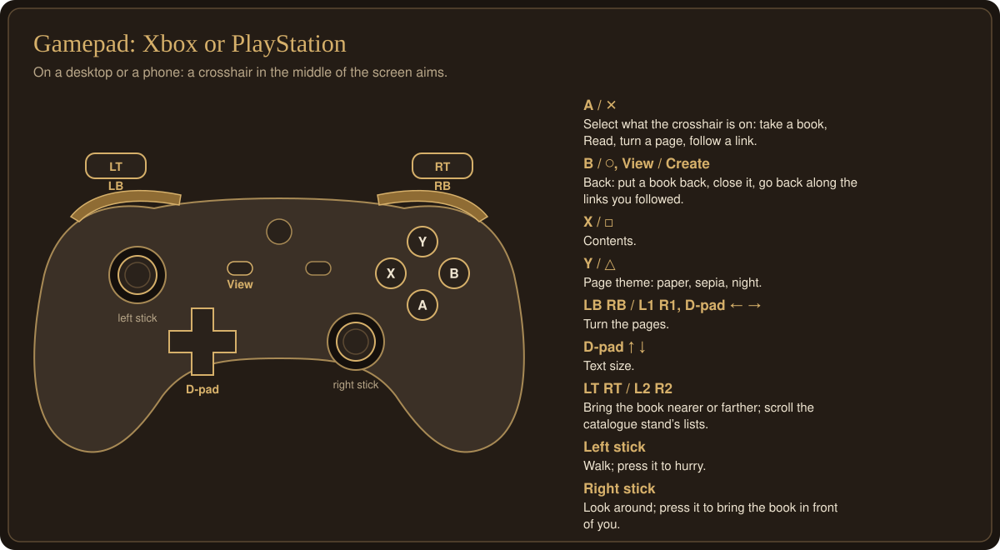

The catalogue stand next to where you start lets you re-shelve the books by title, author or
popularity, jump to a letter, pick a book at random ("Surprise me"), reopen recently read books,
filter a large library by genre and title letter, rescan the folder, and reload the page (handy
in a headset, where the browser's own controls are out of reach). Its footer, and the library
card, show when the app's files last changed ("Updated …"), so you can tell which version a page
is running. The search box (desktop and phone), or the kiosk's Search tab with its on-screen
keyboard (in a headset), finds any book by title or author and takes you to it, and any
Wikipedia article by title and opens its volume there. Your reading position, text size, theme and
rooms are remembered in the browser.

To report a problem, open the help (**?**) and press **Copy debug info**, then paste the result
into your message: it says which browser, graphics and version of the site you have, where you
were, and the page's last errors. If the library fails to open, the error screen has the same
button.

**Save scene** (in the help, or on the catalogue stand in a headset) remembers where you are:
the room, where you stand and look, the book you have open and its page, and the menus.
**Restore scene** takes you back there. In the help you can also paste a scene, or a debug report
someone sent you, and restore it: you see what they saw.

## The online version

<https://ariamokr.github.io/vrlbry/> is the same app as a static website, without the Node server.
It has a demo set of Kiwix's ZIM files (a Gutenberg collection, Wikipedia 100, and Wikipedia's
Chemistry, Medicine, Mathematics, Physics and Golf), opens more from Kiwix's library or from your
device, and notices a new version within seconds and offers to reload. How it is built and
deployed is in [docs/DEVELOPMENT.md](docs/DEVELOPMENT.md#the-online-version-github-pages).

## Developing

Tests, the static site's build and workflow, the edge proxy and measuring performance on a Quest
are in [docs/DEVELOPMENT.md](docs/DEVELOPMENT.md). [SPEC.md](SPEC.md) is the contract between the
modules and [TODO.md](TODO.md) lists open work.

## License

[MIT](LICENSE).
